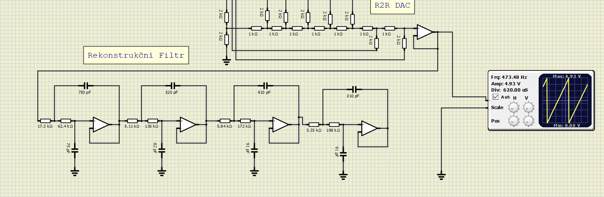
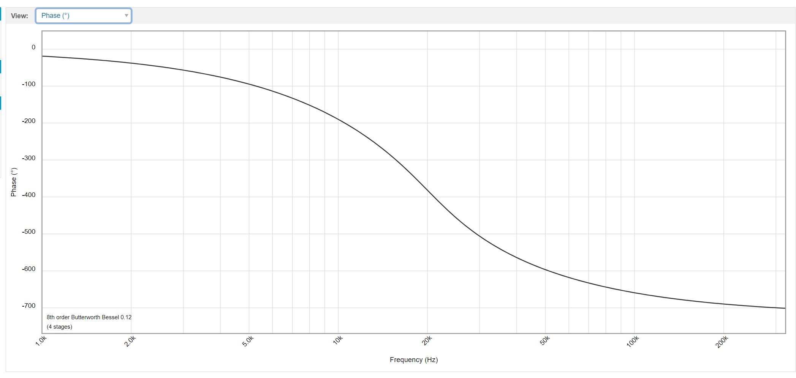

# DAC převodník

## Cíle projektu

Sestavit R2R 8bitový DAC převodník ovládaný keypadem o rozměrech 4x3 tlačítek. S výstupem na display a UART.
### Shrnutí funkcí
* Převodník DAC s analogovou částí rekonstrukčních filtrů
* Proměnlivá frekvence generovaného signálu 100-2000Hz
* Různé typy signálů: (sinus, pila, obdélník, trojúhelník, pulzy, DTMF)
	

## Popis Hardware

### Schéma digitální části

Jádrem digitální části je mikrokontrolér ATMEGA 328P, který slouží k ovládání displaye, čtení z keypadu, ovládání R2R převodníku a komunikace přes UART. Jeho periferie jsou tedy klávesnice LCD display 16x2 znaků a R2R převodník. 
LCD display komunikuje v 4 bitovém módu pro ušetření pinů. Každý sloupec respektive tlačítko keypadu se čte s opakovací frekvencí 325 Hz.

### Schéma analogové části

Analogová část se skládá ze samotného R2R ladderu, kde byly zvoleny hodnoty rezistorů 1 respektive 2 kOhm jako kompromis mezi zatížením pinů a rozumnou výstupní impedancí převodníku. Na nej je ihned navázán sledovač v podobě 
neinvertujícího zapojení operačního zesilovače, který slouží jako impedanční transformátor mezi R2R převodníkem a rekonstrukčními filtry.

### Návrh Rekonstrukčního filtru
Rekonstrukční filtr typu DP byl navržen nástrojem firmy Analog Devices Analog Filter Wizard. Byl navržen jako DP 4. řádu s Butterworth Beselovou aproximací. Méně strmé aproximace byly zvoleny z důvodu fázového zkreslení.
Jako mezní frekvence byla zvolena frekvence 10 kHz, což dává rezervu 8 kHz nad maximální fundamentální složkou generovaného signálu (2 kHz) a zároveň umožňuje potlačit výrazně repliku spektra nad fvz/2=31 kHz.

Výsledné charakteristiky:

## Popis kódu a simulace

Kód využívá dvou časovačů TIMER0 a TIMER2. TIMER0 se využívá ke generování výstupního signálu, tedy jeho přetečení určuje vzorkovací frekvenci, ta je nastavena na 62,5 kHz. Při každém přetečení timeru nastává posunutí 
ve frame bufferu na další hodnotu. V případě, že se dojde na konec aktivní oblasti frame bufferu(konec periody) začíná se znovu. V této funkci přerušení se nacházejí dva řádky v assembleru pro vyvážení počtu instrukcí 
v případě návratu na začátek pole respektive v případě posunu v poli (frame bufferu).

Druhý timer TIMER2 slouží ke sledování 4x3 keypadu, dekódování stisknutého tlačítka a obsluze frame bufferu z hlediska úpravy frekvence typu signálu, případně použitých parametrů. Stejně tak slouží k aktualizaci displeje
a odesílání dat přes UART on demand. 

Ovládání keypadu je debouncováno a je ošetřeno přepínání funkce pomocí tlačítka F. V přípdě generování DTMF.

U všech signálů je možné nastavit generovanou frekvenci v rozmezí 100 Hz až 2 kHz. V případě generování DTMF je generována základní funkce sinus ke které se přičítá její násobek v rozmezí 1-5.

Nastavení frekvence se provádí tlačítky + a - s tím že při držení dochází k postupnému zvyšování kroku frekvence, pro rychlejší přeběh intervalu frekvencí.
Po stisku tlačítka F se dá v módu DTMF měnit násobek druhé frekvence. po opětovném stisku se vrátíme k nastavení frekvence. Tlačítko F funguje pořád a jeho status se zobrazuje na displeji.

## Video/Animation

*Write your text here*

## References

* https://www.tek.com/blog/tutorial-digital-analog-conversion-r-2r-dac
* http://www.peterfleury.epizy.com/avr-software.html
